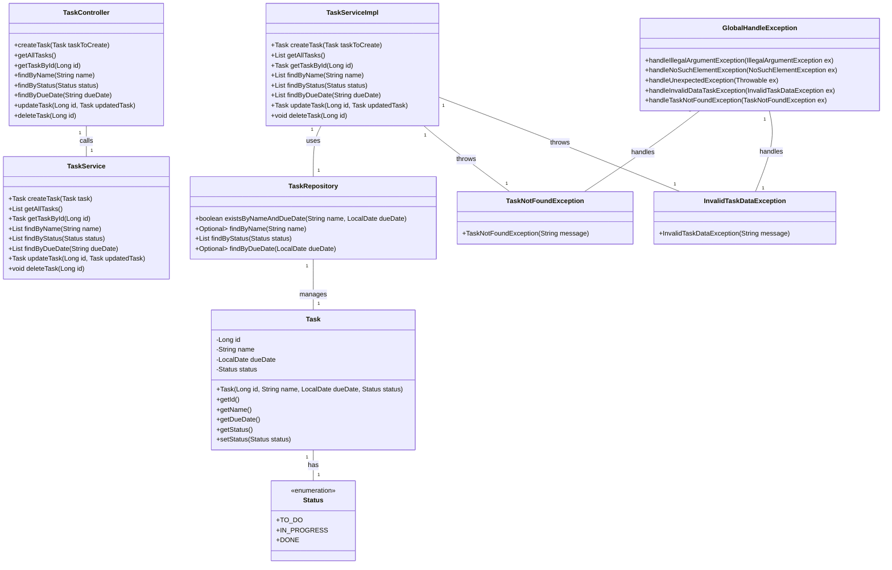

# To-Do List API -

### PT-BR:

RESTful API de lista de tarefas para o projeto final do bootcamp Claro - Java com Spring Boot da plataforma [DIO](https://web.dio.me).  
Construída em Java 17 e Spring Boot 3.
#### Desenvolvido por: [Lucas-LDev](https://github.com/Lucas-LDev)

## Tecnologias utilizadas:
- Java 17
- Spring Boot 3
- Spring Data JPA
- OpenAPI (Swagger)
- H2 Database

## Funcionalidades da API:
- Criar tarefas
- Atualizar tarefas
- Deletar tarefas
- Listar todas as tarefas salvas
- Buscar tarefa por ID
- Buscar tarefas por nome
- Buscar tarefas por status
- Buscar tarefas por data de validade

## Observação:
- Banco de dados em memória, via H2 Console.

## Configuração:
Para usar essa API, você precisa ativar o perfil de desenvolvimento. Para isso, defina a variável de ambiente `SPRING_PROFILES_ACTIVE` com o valor `dev` na sua IDE:
- Nome da variável: `SPRING_PROFILES_ACTIVE`
- Valor da variável: `dev`
Isso permite que a API use as configurações de desenvolvimento definidas no arquivo `application-dev.yml`.

### Gerenciamento do Banco de Dados H2:
- Acesse o console H2: `http://localhost:8080/h2-console`
- Utilize as credenciais que estão no arquivo `application-dev.yml`, localizado na pasta `src/main/resources`.

### Acesso ao Swagger:
- Acesse o Swagger para testar os endpoints: `http://localhost:8080/swagger-ui/index.html`

## Diagrama de Classes:

---

# To-Do List API -

### EN-US:
RESTful API for a to-do list, developed as the final project for the Claro Java with Spring Boot bootcamp on the [DIO](https://web.dio.me) platform.  
Built with Java 17 and Spring Boot 3.
#### Developed by: [Lucas-LDev](https://github.com/Lucas-LDev)

## Technologies Used:
- Java 17
- Spring Boot 3
- Spring Data JPA
- OpenAPI (Swagger)
- H2 Database

## API Features:
- Create tasks
- Update tasks
- Delete tasks
- List all saved tasks
- Search task by ID
- Search tasks by name
- Search tasks by status
- Search tasks by due date

## Note:
- In-memory database via H2 Console.

## Configuration:
To use this API, you need to enable the development profile by setting the `SPRING_PROFILES_ACTIVE` environment variable to `dev` in your IDE:
- Variable name: `SPRING_PROFILES_ACTIVE`
- Variable value: `dev`

This allows the API to use the development configurations set in the `application-dev.yml` file.

### H2 Database Management:
- Access the H2 console: `http://localhost:8080/h2-console`
- Use the credentials located in the `application-dev.yml` file in the `src/main/resources` folder.

### Swagger Access:
- Access Swagger to test the endpoints: `http://localhost:8080/swagger-ui/index.html`

### Class Diagram:

